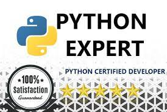

<h1 align="center" style="letter-spacing: 10px;">
  Python Expert
</h1>

  

## Core Skills

- <b>Programming Languages</b> : Python
- <b>Python Frameworks</b> : Django, Flask, FastAPI
- <b>Database Systems</b> : MySQL, PostgreSQL, MongoDB
- <b>Version Control</b> : Git, SVN
- <b>Web Technologies</b> : HTML, CSS, JavaScript
- <b>Other Tools</b> : Jupyter Notebook, PyCharm, Anaconda, Docker